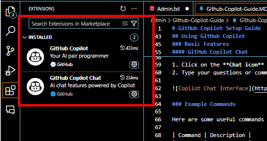

# GitHub Copilot Setup Guide

## Prerequisites
Before enabling GitHub Copilot, ensure you have completed the following:

- [x] Registered a GitHub account
- [x] Requested access to the company organization on GitHub

If not completed yet, follow [Internal Confluence Guide on GitHub](https://yardi.atlassian.net/wiki/spaces/BUIL/pages/352585011/Creating+your+GitHub+account+and+requesting+access+to+repositories).

## Enabling GitHub Copilot

### 1. Request Access to GitHub Copilot

GitHub Copilot requires specific permissions from your organization before you can use it.

1. Navigate to [GitHub Copilot Settings](https://github.com/settings/copilot?editor=copilot_1.250.0)
2. Scroll to the bottom of the page

3. Click on **"Request access from organization"**
4. Wait for approval from your organization administrator

> **Note:** Your organization admin will receive a notification about your request and will need to approve it before you can proceed.

### 2. Install GitHub Copilot in Visual Studio Code

Once you have received access approval:

1. Open Visual Studio Code
2. Navigate to the Extensions panel (or press `Ctrl+Shift+X` / `Cmd+Shift+X`)
3. Search for "GitHub Copilot"
4. Click on **Install**

test2 

### 3. Authenticate GitHub Copilot

After installation, you'll need to authenticate:

1. A notification will appear in VS Code prompting you to sign in
2. Click **Sign in to GitHub**
3. Your browser will open, asking you to authorize GitHub Copilot
4. Follow the prompts to complete authentication
5. Return to VS Code - you should see a confirmation message when authentication is successful

## Using GitHub Copilot

### Basic Features

#### Inline Code Suggestions

As you type code, GitHub Copilot will automatically suggest completions:

- Accept a suggestion by pressing `Tab`
- Reject a suggestion by pressing `Esc`
- Navigate through multiple suggestions using `Alt+]` and `Alt+[`

#### GitHub Copilot Chat

Access the more powerful features through the Copilot Chat interface:

1. Click on the **Chat icon** in the left sidebar of VS Code
2. Type your questions or commands in the chat panel

### Example Commands

Here are some useful commands to try in the Copilot Chat:

| Command | Description |
|---------|-------------|
| `Explain this code` | Get an explanation of selected code |
| `Refactor this function to be more efficient` | Get suggestions for code improvements |
| `Write a unit test for this function` | Generate test code for your functions |
| `How do I implement [feature]?` | Get guidance on implementing specific features |
| `Debug this code` | Get help identifying issues in problematic code |

### Best Practices

- Be specific in your requests for better results
- Review all suggestions before accepting them
- Use Copilot Chat to understand complex code or design patterns
- Provide context when asking for code generation

## Troubleshooting

If you encounter issues:

1. Ensure you have the latest version of the extension
2. Check your GitHub Copilot subscription status
3. Try signing out and signing back in
4. Restart VS Code
5. Contact IT support if problems persist

## Resources

- [Yardi Confluence Guide](https://yardi.atlassian.net/wiki/spaces/BUIL/pages/352585011/Creating+your+GitHub+account+and+requesting+access+to+repositories)
- [Official GitHub Copilot Documentation](https://docs.github.com/en/copilot)
- [Visual Studio Code Marketplace: GitHub Copilot](https://marketplace.visualstudio.com/items?itemName=GitHub.copilot)
- [GitHub Copilot Chat Documentation](https://docs.github.com/en/copilot/github-copilot-chat/using-github-copilot-chat)

---

**For a peek into LLM capabilities, this whole document was created using the following prompt:**

<i>

"
Presumptions:

Assume the user has just completed the Confluence (Company Documentation) regarding GitHub Copilot.  
The user has:  
- Registered an account.  
- Requested access to the company’s GitHub.  
Objective: Enable GitHub Copilot

Request Access to Copilot:

Navigate to: GitHub Copilot Settings.  
Scroll to the bottom of the page.  
Click on "Request Access from Organization".

Install the Copilot Plugin:

Install the GitHub Copilot plugin in your IDE (e.g., Visual Studio Code).

GitHub Copilot Login & Authorization:

Log in to GitHub Copilot within Visual Studio Code.  
Authorize the plugin as required.

Start Using GitHub Copilot:

Locate the Chat icon on the left sidebar.  
Try a few basic commands to explore the possibilities.

Documentation Task:

Create a Markdown File:

Create a file in your current directory with the .md extension.  
Name the file GitHub-Copilot-Guide.MD.

Content Requirements:

Include all of the above steps.  
Add any additional details needed for clarity.  
Format the content using Markdown (headers, bullet points, bold text, and new lines) to ensure it is clear and visually appealing.  
Document each phase of the tutorial slowly and step by step, ensuring it is easy for others to understand how to enable and start using GitHub Copilot.
"
</i>

---

## Final Note: Collaborate with AI Wisely

While GitHub Copilot is a powerful tool that can significantly boost your productivity, it is important to remember that AI-generated suggestions should always be reviewed and verified. Use Copilot as a collaborative partner, and ensure that you:

- **Carefully review** any code or recommendations provided.
- **Cross-check** AI-generated outputs against your project requirements.
- **Maintain a healthy skepticism** and don't rely solely on the AI's suggestions.
- **Collaborate** with the tool by integrating its input with your own expertise to produce the best results.

By following these guidelines, you can effectively work with GitHub Copilot while ensuring the quality and integrity of your code.

---

Continue Reading on Confluence - [How to Migrate a TFS Project to Github](https://yardi.atlassian.net/wiki/spaces/BUIL/pages/403570783/Migrating+a+project+from+TFS+to+Github)
